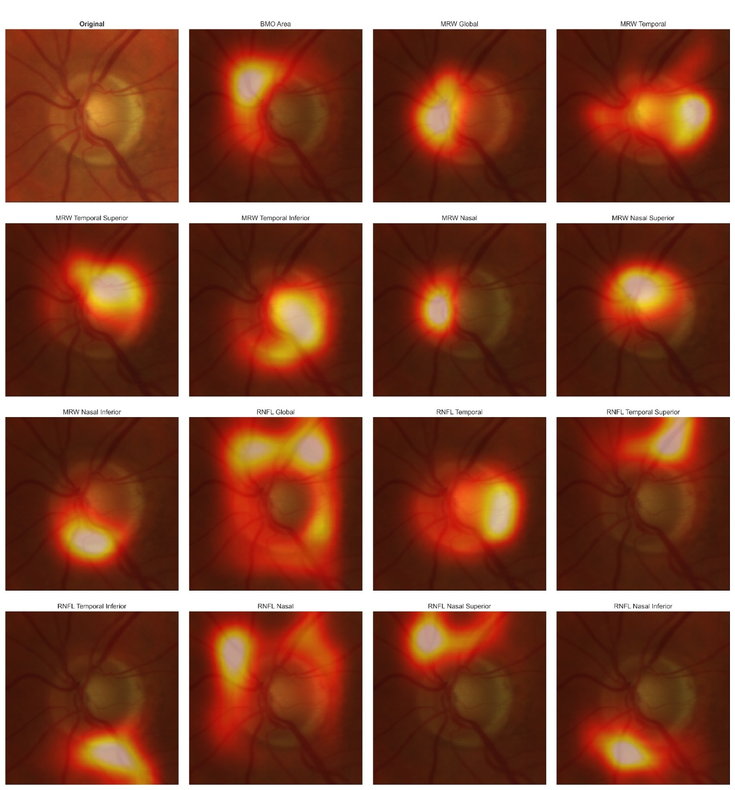

# DiscFoundGlobal

A DINOv2 ViT-Small model further pre-trained on over half a million optic disc crops from fundus images via self-supervised token reconstruction. Model can be frozen or finetuned for multi-purpose downstream tasks.


*Attention maps generated by DiscFoundGlobal for predicting OCT-derived structural parameters (BMO Area, MRW sectors, RNFL sectors) from optic disc fundus photographs. Brighter regions indicate higher attention weight. Note that the model learned to identify the anatomical regions correlating to the measured OCT prameters.*

---

Download `DiscFoundGlobal.pth` from https://github.com/stephanmkonig/DiscFoundGlobal/releases/tag/Model.

## Loading the model
```python
import timm
import torch
model = timm.create_model('vit_small_patch14_reg4_dinov2', img_size=(392, 392), num_classes=0)
state_dict = torch.load('DiscFoundGlobal.pth', weights_only=True)
model.load_state_dict(state_dict)
model.eval()
```

## Inference
Images must be resized to **392×392** and normalized with **mean=0.5, std=0.5**.
```python
import torch
from torchvision.transforms import v2 as T
from torchvision.io import read_image
transform = T.Compose([
    T.Resize((392, 392), antialias=True),
    T.ToDtype(torch.float32, scale=True),
    T.Normalize(mean=[0.5], std=[0.5]),
])
img = read_image('fundus.jpg')           # [C, H, W] uint8
img = transform(img).unsqueeze(0)        # [1, 3, 392, 392]
with torch.inference_mode():
    tokens = encoder.forward_features(img)   # [1, 789, 384]
```
`forward_features` returns 789 tokens: 1 CLS token, 4 register tokens, and 784 patch tokens (28×28 patches).
